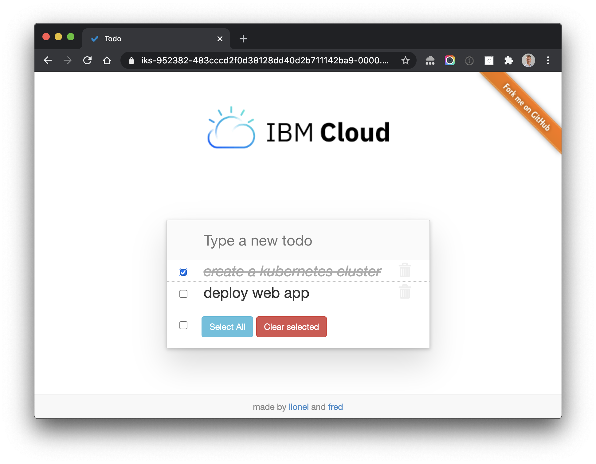

This sample application is built with a CLEAN stack (CLoudant NoSQL database, Express, Angular and Node.js) and is ready to be deployed on IBM Bluemix.

To find out how to deploy this application on IBM Bluemix, follow this [tutorial](https://github.com/lionelmace/bluemix-labs/tree/master/labs/Lab%20CloudFoundry%20-%20Deploy%20TODO%20web%20application)
