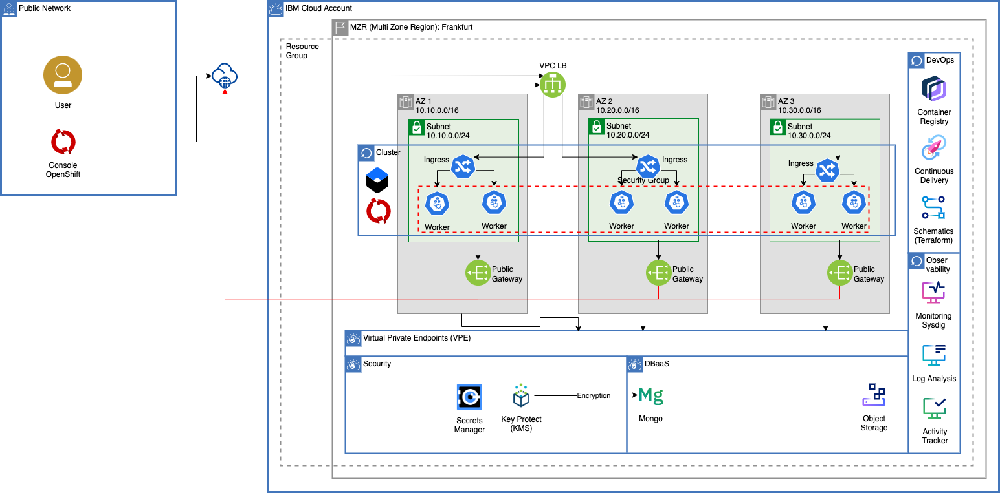

# Cloud Native Application

This Cloud Native Web App built with a common stack (Kubernetes, Mongo, Express, Angular and Node.js) is ready to be deployed on a container platform on IBM Cloud .

This repo also includes the terraform resources to provision the underlying Cloud Native infrastructure to run this app.

## Additional Resources

* To provision via Terraform the underlying infrastructure to run this app, follow this [tutorial](./README-terraform.md)

* To deploy this app in an automated way using IBM Cloud DevOps Toolchain, follow this [tutorial](./README-toolchain.md)

* To deploy this app step by step on top of an IKS (IBM Cloud Kubernetes Service) cluster, follow this [tutorial](https://lionelmace.github.io/iks-lab)