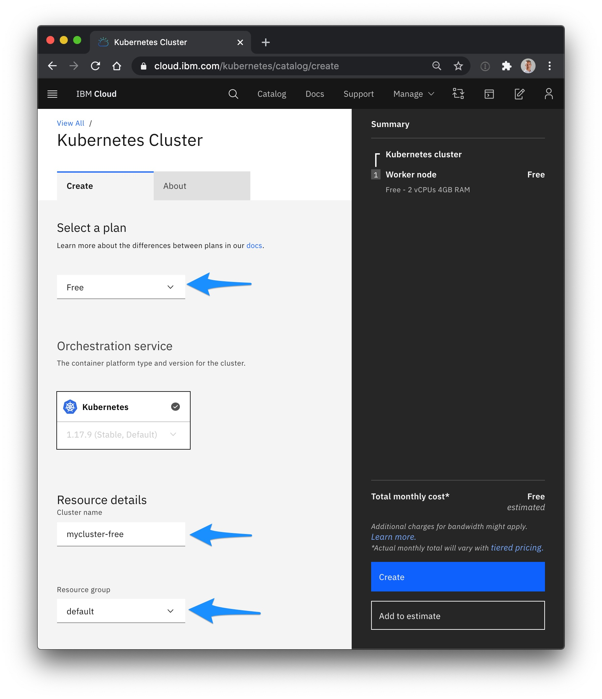
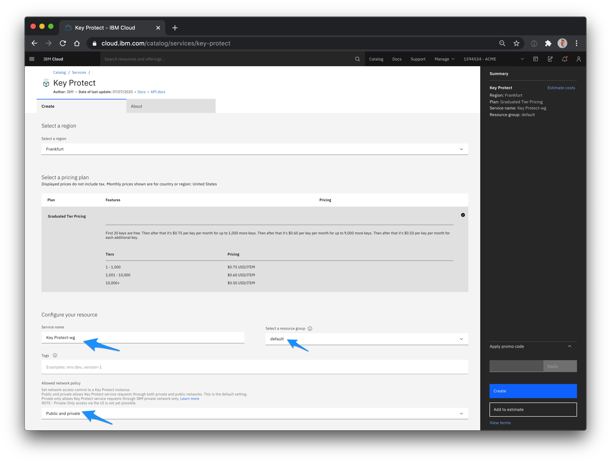
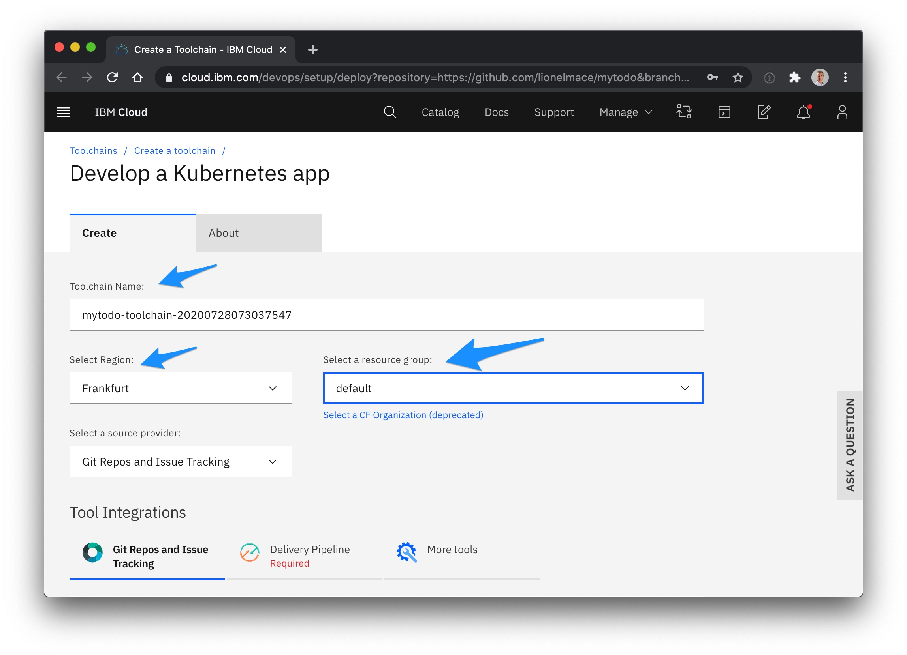
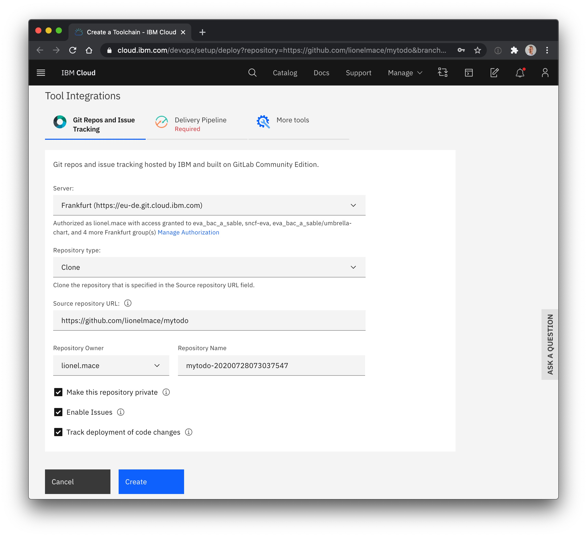
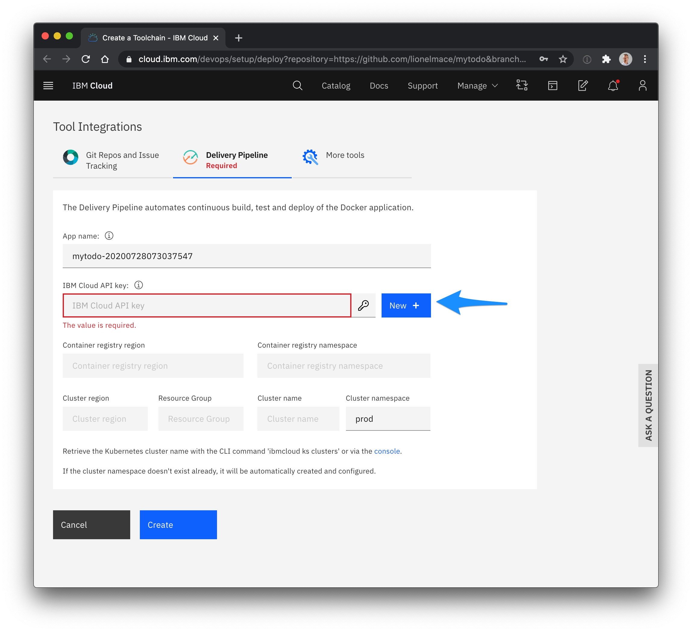
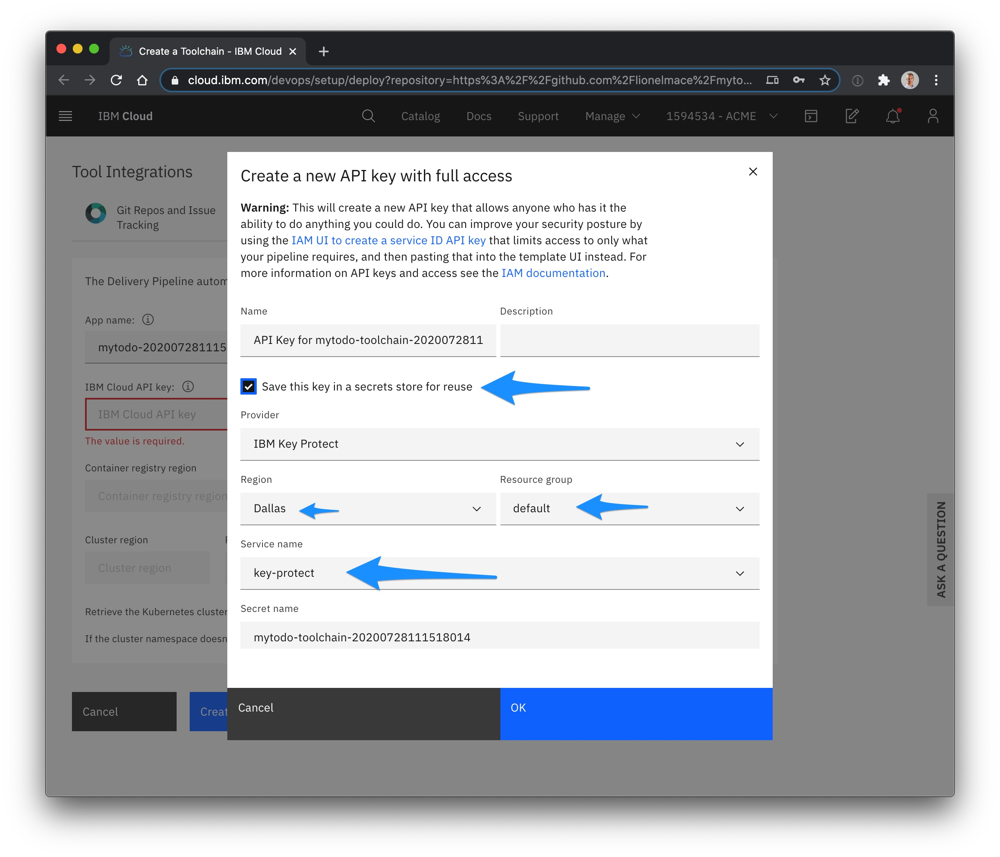
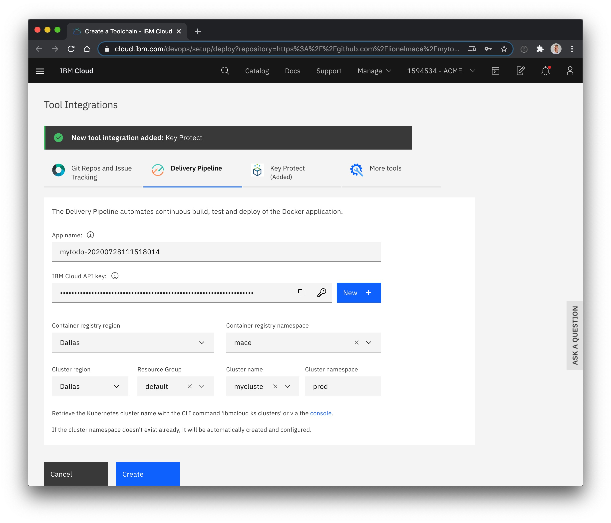
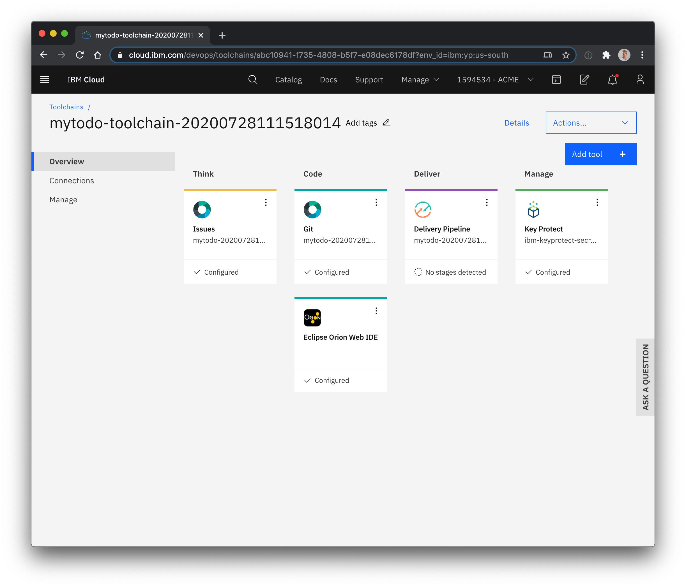
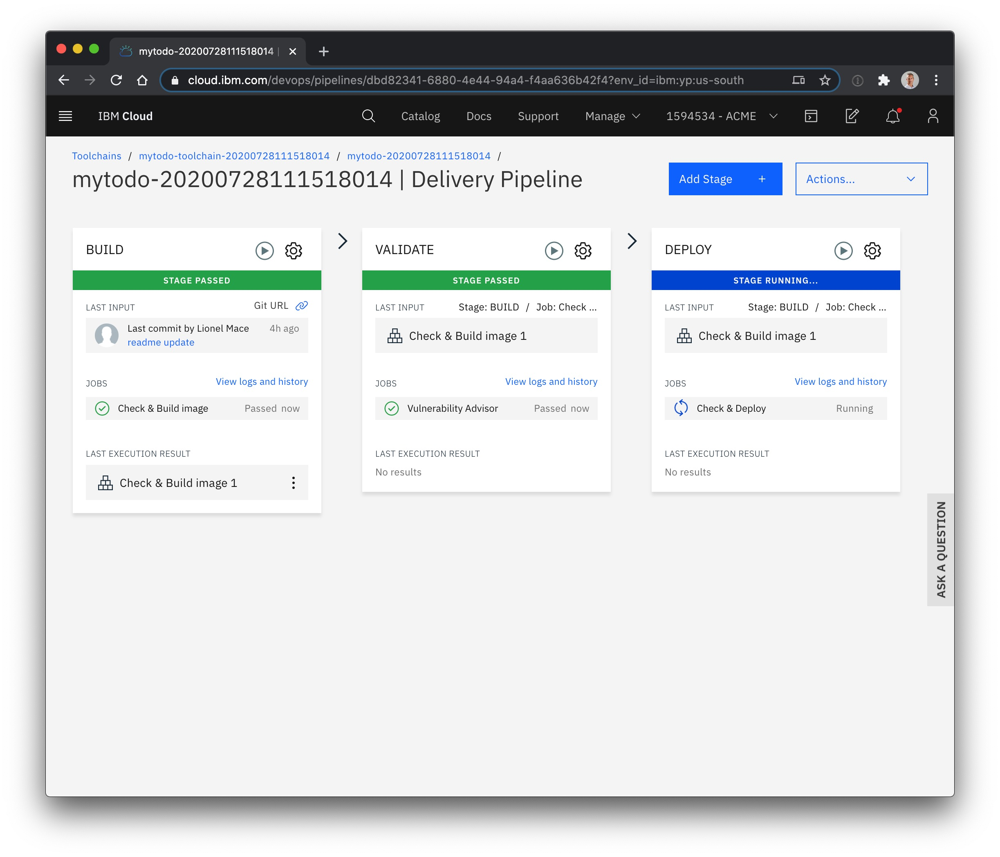
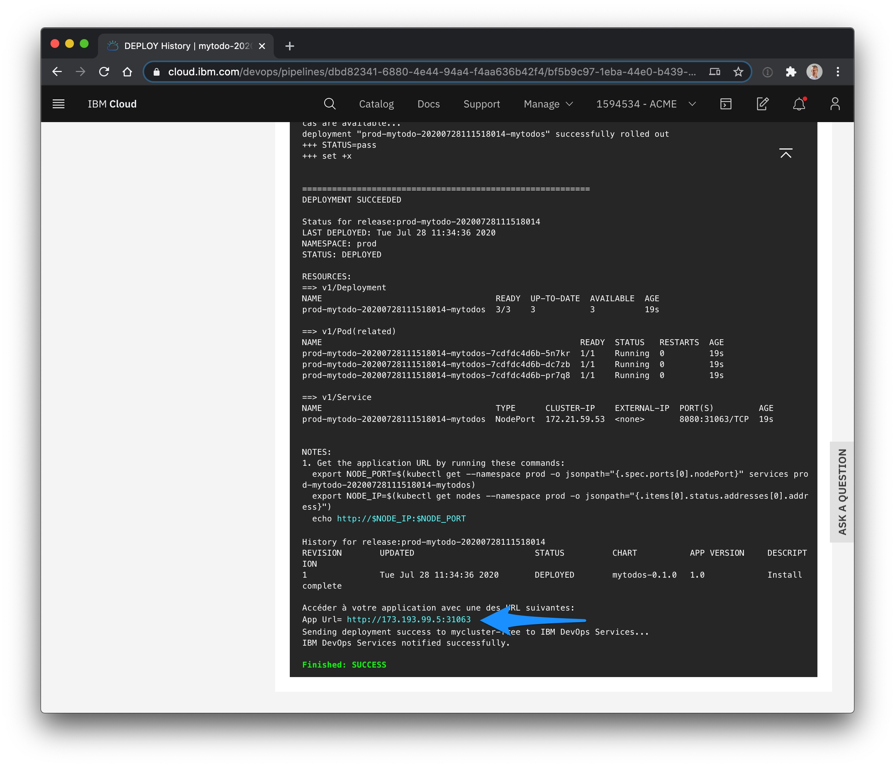

# Introduction

This web app built with a CLEAN stack (CLoudant NoSQL DB, Express, Angular and Node.js) is ready to be deployed on ICP (IBM Cloud Platform).

Watch this 6 mins <a href="https://youtu.be/XVVb-aLw9ow" target=”_blank”>YouTube video</a> to understand all the deployment steps below. Note: this video excludes the cluster provisioning.

# How to deploy this app in Kubernetes?

1. If you don't already have a Kubernetes cluster, create one for **Free** from IBM Cloud Catalog by selecting the [Kubernetes Service](https://cloud.ibm.com/kubernetes/catalog/create).

    Give it a **Name** and select a **Resource Group**.
    > 20 min provisioning time

    

1. [Optional] If you want to securely store your API Key used in the Continuous Delivery later, provision a service [Key Protect](https://cloud.ibm.com/catalog/services/key-protect).

    Make sure to select the same **Region** as your cluster location, enter a **Service Name**, select a **Resource Group** and a **Network Policy**.
    > 2 min provisioning time

    

1. To automate the deployment of this app into your Kubernetes cluster, click the button below.

    

1. Enter a **Toolchain Name**, select the **Region** and a **Resource Group** where your cluster was created.

    

1. In the tab **Git Repos and Issue Tracking**, keep the default setting .

    

1. In the tab **Delivery Pipeline**, create a new API Key.

    

1. A panel will open, check the option **Save this key in a secrets store for resuse** if you have created an instance of the service Key Protect.
    > Keep this option unchecked if you have decided not to use Key Protect.

    

1. The toolchain will automatically try to fill out the remaining information. Control the Resource Group, the region and the cluster name, then, click **Create**. 

    

1. The toolchain is being created. That includes a Github repo to clone the source code of the app. 

    

1. Click **Delivery Pipeline** in the Overview. You will see the stages progressing in pipeline.

    > 6 min deployment time 
    

1. Click the link **View logs and history** in the last stage **DEPLOY**. Scroll down to the bottom. You will find the link to your application.

    

    > If you have a free cluster, the url will be using the IP address of a worker node.
    > If you have a paid cluster, the url will be a domain name finishing with *.appdomain.cloud.

Congratulations! Your app is up and running in the cluster.

# Step by step Deployment

Those two tutorials will show you in details how to deploy this step by step:

* With IKS (IBM Cloud Kubernetes Service), follow this [tutorial](https://lionelmace.github.io/iks-lab)

* With ICF (IBM Cloud Foundry), follow this [tutorial](https://github.com/lionelmace/ibmcloud-labs/tree/master/labs/Lab%20Cloud%20Foundry%20-%20Deploy%20TODO%20web%20application)