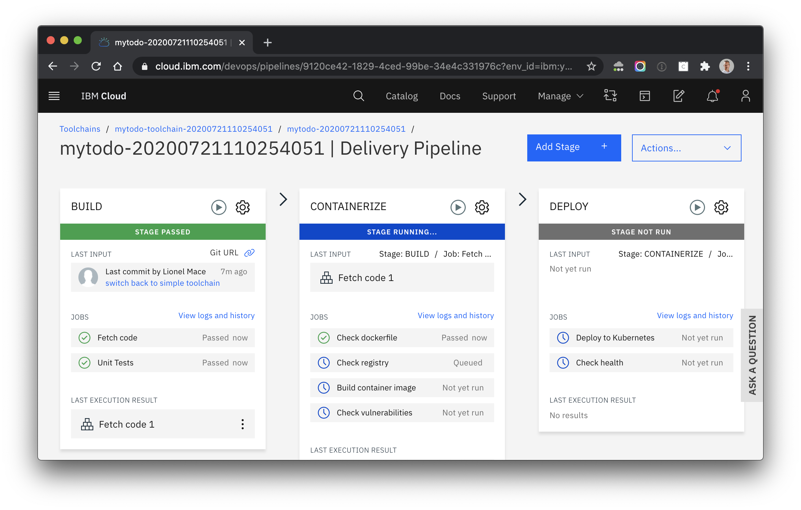

# Introduction

This web app built with a CLEAN stack (CLoudant NoSQL DB, Express, Angular and Node.js) is ready to be deployed on ICP IBM Cloud Platform.

# How to deploy this app?

1. If you don't already have a Kubernetes, create a **Free** one from IBM Cloud Catalog by clicking [Kubernetes Service](https://cloud.ibm.com/kubernetes/catalog/create).

    Give it a **Name** and select a **Resource Group**.
    > 20 min provisioning time

    

1. [Optional] Provision a **Key Protect** Service by clicking [Key Protect](https://cloud.ibm.com/catalog/services/key-protect).

    Give it a **Name**, select a **Resource Group** and a **Network Policy**.
    > 2 min provisioning time

    

    

1. Deploy this app in a few clicks into your Kubernetes cluster using the DevOps toolchain.

    > 6 min deployment time 

    

1. Delivery Pipeline

    

# Step by step Deployment

Those two tutorials will show you in details how to deploy this step by step:

* With IKS (IBM Cloud Kubernetes Service), follow this [tutorial](https://lionelmace.github.io/iks-lab)

* With ICF (IBM Cloud Foundry), follow this [tutorial](https://github.com/lionelmace/bluemix-labs/tree/master/labs/Lab%20CloudFoundry%20-%20Deploy%20TODO%20web%20application)