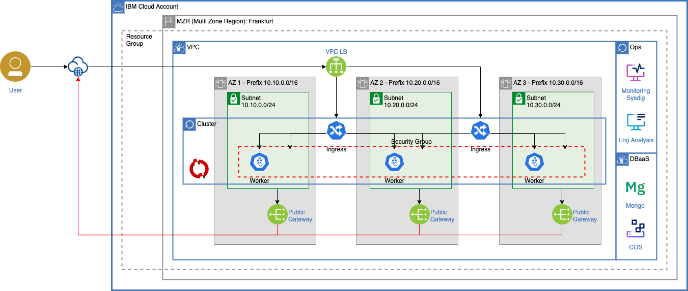

# Deploy the solution using Terraform

Version: `1.45.0`

In this tutorial, we'll use terraform to provision the following architecture:



All those service instances will be created by terraform:

* VPC with 3 subnets, 3 public gateways
* Kubernetes cluster
* OpenShift cluster
* Mongo Standard DBaaS
* Mezmo Logging
* Sysdig
* COS with a bucket
* Key Protect

> Both LogDNA and Sysdig instance will be attached to both clusters.

## Install Terraform

1. Download and install Terraform for your system. [https://learn.hashicorp.com/terraform/getting-started/install.html](https://learn.hashicorp.com/terraform/getting-started/install.html)

1. On MacOS, Terraform can also be installed using Terraform version manager `tfenv`

    ```sh
    brew install tfenv
    ```

    ```sh
    tfenv install <version>
    ```

    For example:

    ```sh
    tfenv install 1.1.9
    ```

1. Once installed, switch to a version to use

    ```sh
    tfenv use 1.1.9
    ```

1. Check Terraform installation by running `terraform` in your terminal. You should see a list of **Common commands**.

## Provision all resources

1. Export API credential tokens as environment variables

    ```sh
    export TF_VAR_ibmcloud_api_key="Your IBM Cloud API Key"
    ```

1. Go to the terraform folder

    ```sh
    cd cloud/terraform
    ```

1. Terraform must fetch the IBM Cloud provider plug-in for Terraform from the Terraform Registry.

    ```sh
    terraform init
    ```

    Output

    ```sh
    Initializing modules...

    Initializing the backend...

    Initializing provider plugins...
    - Reusing previous version of sysdiglabs/sysdig from the dependency lock file
    - Reusing previous version of ibm-cloud/ibm from the dependency lock file
    - Using previously-installed sysdiglabs/sysdig v0.5.10
    - Using previously-installed ibm-cloud/ibm v1.31.0
    Terraform has been successfully initialized!
    ```

1. Edit the variables in `testing.auto.tfvars` if you want to change some services name.

1. Perform a dry run to show what infrastructure terraform intends to create

    ```sh
    terraform plan -var-file="testing.auto.tfvars"
    ```

    > You can activate debug log by running: *export TF_LOG=TRACE*

1. Start provisioning

    ```sh
    terraform apply -var-file="testing.auto.tfvars"
    ```

    > You can apply to a single resource `terraform apply -target=ibm_container_cluster.cluster`

1. Once provisioned, reads and outputs a Terraform state or plan file in a human-readable form.

    ```sh
    terraform show
    ```

## Remove all resources

Finish by deleting all of the resources created by the configuration to minimize cost.

1. Clean up

    ```sh
    terraform destroy -var-file="testing.auto.tfvars"
    ```

## Resources

* IBM Cloud Terraform Provider is available on [HashiCorp Terraform Registry](https://registry.terraform.io/providers/IBM-Cloud/ibm).
